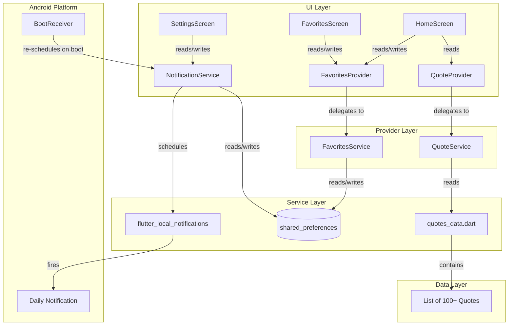
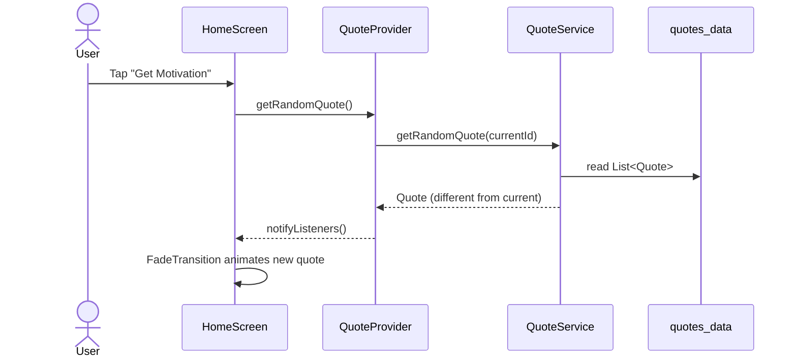
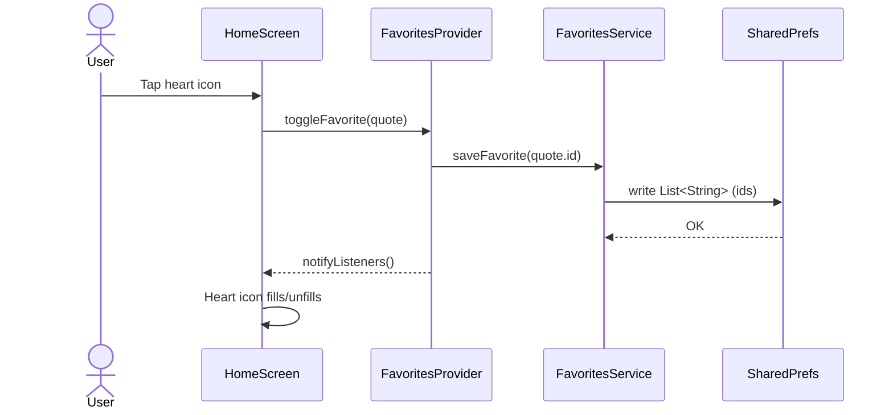
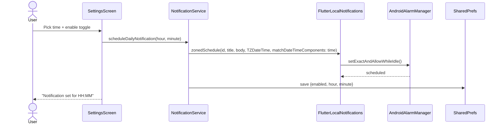

# ARCHITECTURE.md — KindWords

**Version:** 1.0  
**Last updated:** 2026-03-18

---

## 1. Architectural Decision: Layer-First Structure

**Decision:** Layer-first folder structure (models / data / services / providers / screens)

**Rationale:** KindWords has three features but a single screen domain. Feature-first organization adds directory nesting overhead without benefit when features don't share sub-components. Layer-first keeps related technical concerns together and is idiomatic Flutter for apps with < 10 screens.

**Alternative considered:** Feature-first (`lib/features/quotes/`, `lib/features/favorites/`, `lib/features/notifications/`). Rejected because it splits the Quote model across features and adds indirection for a 3-feature app.

---

## 2. State Management Decision: Provider

**Decision:** `provider` package (ChangeNotifier pattern)

**Rationale:** The app has exactly two pieces of mutable global state — the current displayed quote, and the favorites list. Provider is the simplest solution with zero boilerplate overhead. Riverpod adds compile-time safety and DI features not needed for this scope. `setState` alone would require prop drilling from HomeScreen into navigation for favorites count badges.

**Pattern:**
- `QuoteProvider` — holds current `Quote`, exposes `getRandomQuote()`
- `FavoritesProvider` — holds `List<Quote>`, exposes `addFavorite()`, `removeFavorite()`, `isFavorite()`
- Both providers initialized at `MaterialApp` root via `MultiProvider`

---

## 3. Component Diagram



---

## 4. Data Flow Diagrams

### 4.1 Quote Display Flow



### 4.2 Save Favorite Flow



### 4.3 Notification Scheduling Flow



---

## 5. Data Models

### 5.1 Quote

```dart
/// Immutable value object representing a single motivational quote.
class Quote {
  final String id;      // "q001" .. "q100+" — stable identifier for favorites
  final String text;    // The quote body
  final String? author; // Optional attribution; null means anonymous

  const Quote({
    required this.id,
    required this.text,
    this.author,
  });

  @override
  bool operator ==(Object other) => other is Quote && other.id == id;

  @override
  int get hashCode => id.hashCode;
}
```

### 5.2 Favorites Persistence Schema

```
SharedPreferences key: "favorite_quote_ids"
Type: String (JSON-encoded List<String>)
Example: '["q003","q017","q042"]'

SharedPreferences key: "notification_enabled"
Type: bool
Default: false

SharedPreferences key: "notification_hour"
Type: int (0–23)
Default: 8

SharedPreferences key: "notification_minute"
Type: int (0–59)
Default: 0
```

---

## 6. Android Integration Notes

### 6.1 Exact Alarm Scheduling

`flutter_local_notifications` uses `setExactAndAllowWhileIdle` on Android 12+ which requires either:
- `SCHEDULE_EXACT_ALARM` — user must grant via Settings on API 31–32
- `USE_EXACT_ALARM` — auto-granted for clock/calendar apps on API 33+

Both permissions are declared in `AndroidManifest.xml`. The app requests the SCHEDULE_EXACT_ALARM permission at runtime when the user first enables notifications.

### 6.2 Boot Receiver

A `BootReceiver` BroadcastReceiver is registered in `AndroidManifest.xml` to re-schedule the daily notification after device reboot (notifications are cleared on reboot by Android).

### 6.3 Notification Channel

A notification channel `kindwords_daily` is created at app startup with:
- Importance: `IMPORTANCE_DEFAULT`
- Sound: default
- Vibration: enabled

---

## 7. File Structure

```
kindwords/
├── AGENTS.md
├── SPEC.md
├── README.md
├── pubspec.yaml
├── docs/
│   └── ARCHITECTURE.md          (this file)
├── vault/
│   ├── ai/threads/
│   └── sprint/
│       ├── PLAN.md
│       ├── backlog/             (task files)
│       ├── ongoing/
│       └── done/
├── lib/
│   ├── main.dart
│   ├── models/
│   │   └── quote.dart
│   ├── data/
│   │   └── quotes_data.dart
│   ├── services/
│   │   ├── quote_service.dart
│   │   ├── favorites_service.dart
│   │   └── notification_service.dart
│   ├── providers/
│   │   ├── quote_provider.dart
│   │   └── favorites_provider.dart
│   └── screens/
│       ├── home_screen.dart
│       ├── favorites_screen.dart
│       └── settings_screen.dart
├── android/
│   └── app/src/main/
│       └── AndroidManifest.xml
└── test/
    └── widget_test.dart
```

---

## 8. Agent Ecosystem (Build Phase)

| Agent | Trigger | Key Skills |
|-------|---------|------------|
| `sdlc-coder[glm-5]` | Wave 1–2 tasks (data, UI) | Standard Flutter widgets, Provider pattern |
| `sdlc-coder[claude-sonnet]` | Wave 3 tasks (notifications) | flutter_local_notifications, Android permissions, exact alarm API |
| `sdlc-qa[claude-sonnet]` | All waves | BDD tests, widget tests, integration verification |
| `sdlc-tech-lead[claude-sonnet]` | Wave 3 review | Android notification complexity, permission flows |

**Rationale for coder split:** `flutter_local_notifications` with exact alarm scheduling on Android 12+ involves platform-channel nuances, permission request flows, and timezone handling that benefit from the heavier model. Waves 1–2 (data embedding, Provider state, basic UI) are well within the lighter model's competency.
